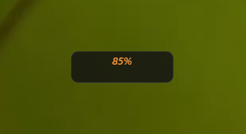

# NightLightDesktop

A compact Rainmeter skin for controlling the Windows Night Light level directly from the desktop.

## Preview

## Features

* Control the Windows Night Light level from the desktop.
* Increase or decrease the level quickly.
* Compact interface.
* Transparent background.
* Lightweight and suitable for permanent desktop use.
* No need to open Windows Settings every time.

## Installation

1. Install Rainmeter.

2. Download the latest ZIP file from the **Releases** section.

3. Extract the downloaded file.

4. Copy the `NightLightDesktop` folder to:

   `Documents\Rainmeter\Skins`

5. Open Rainmeter.

6. Click **Refresh all**.

7. Load `NightLightDesktop.ini`.

## Usage

* Use the increase control to raise the Night Light level.
* Use the decrease control to lower the Night Light level.
* The displayed number shows the currently selected level.

## Requirements

* Windows 10 or Windows 11
* Rainmeter 4.5 or newer
* A device that supports Windows Night Light

## Version

Version 1.0
